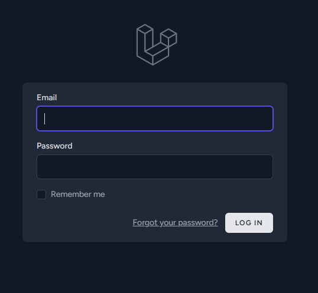
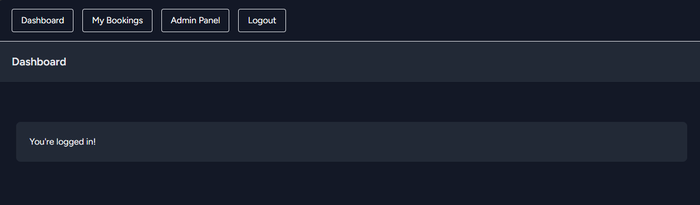
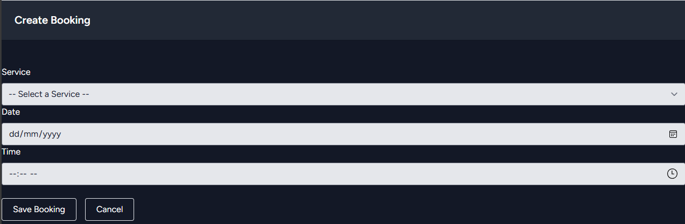
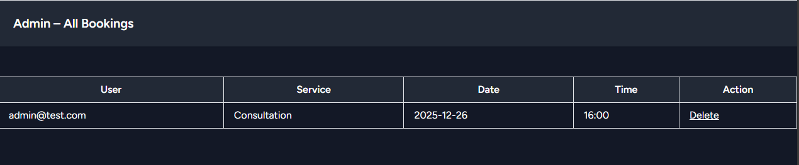

# Secure Booking Management System

A secure web-based Booking Management System developed using Laravel with a strong focus on secure coding practices, access control, and vulnerability mitigation.
This project was developed as part of an Application Security / Secure Web Development assignment.

## Project Overview

The Secure Booking Management System allows authenticated users to create, view, update, and delete service bookings securely.
An admin role is included to manage all bookings. The system applies OWASP Top 10 security controls and was tested using Snyk.

### Objectives:
- Implement a secure CRUD booking system
- Apply authentication & authorization controls
- Protect against common web vulnerabilities
- Log sensitive user actions
- Perform vulnerability scanning and remediation

## 📸 Screenshots

### Login Page


### Dashboard


### Booking Management




### Admin Panel


### Features:

👤 User
- User registration & login
- Email verification
- Create, view, edit, and delete own bookings
- Secure session handling
- CSRF protection

🛡️ Admin
- View all user bookings
- Delete bookings
- Role-based access control (RBAC)

📝 Booking System
- Service selection (dropdown)
- Date & time selection
- Ownership enforcement (users can only modify their own data)

🔍 Audit Logging
- Tracks CREATE, UPDATE, DELETE actions
- Stores user ID, action type, and entity affected

### 🔐 Security Implementations

| Security Control       | Implementation               |
| ---------------------- | ---------------------------- |
| Authentication         | Laravel Breeze               |
| Authorization          | Role-based access control    |
| CSRF Protection        | Laravel CSRF tokens          |
| Session Security       | Secure session configuration |
| Password Hashing       | Bcrypt (Laravel default)     |
| Input Validation       | Server-side validation       |
| Access Control         | Ownership checks             |
| Secure Hashing         | HMAC-SHA256                  |
| Vulnerability Scanning | Snyk                         |
| Audit Logging          | Custom AuditLog model        |

### 🧪 Vulnerability Testing

Security testing was conducted using Snyk, OWASP ZAP and Burp Suite.

### 🛠️ Technologies Used
- Backend: Laravel 10
- Frontend: Blade + Tailwind CSS
- Database: SQLite
- Authentication: Laravel Breeze
- Security Scan: Snyk
- Server: Laravel Herd
- Version Control: Git & GitHub
  
### ⚙️ Installation Guide
1️⃣ Clone Repository
```
git clone https://github.com/aliff-anuar/secure-booking-management-system.git
cd secure-booking-management-system
```

2️⃣ Install Dependencies
```
composer install
npm install
npm run build
```

3️⃣ Environment Setup
```
cp .env.example .env
php artisan key:generate
```

Configure .env:
```
DB_CONNECTION=sqlite
DB_DATABASE=/absolute/path/database.sqlite
```

Create database file:
```
touch database/database.sqlite
```

4️⃣ Run Migrations & Seeders
```
php artisan migrate --seed
```

5️⃣ Start Application
```
php artisan serve
```

### 🔑 Default Accounts
```
Admin
Email: admin@test.com
Password: Admin@123
Role: admin

User
Register via UI or seeders.
```

### 📁 Project Structure (Key Files)
```
app/
 ├── Http/Controllers/
 │   ├── BookingController.php
 │   └── Admin/BookingController.php
 ├── Models/
 │   ├── User.php
 │   ├── Booking.php
 │   └── AuditLog.php

resources/views/
 ├── bookings/
 ├── admin/
 └── layouts/

tests/Feature/Auth/
 └── EmailVerificationTest.php
```

### 📦 Dependencies

This project is built using Laravel and relies on the following dependencies:

### Core Dependencies

| Dependency                  | Purpose                              |
| --------------------------- | ------------------------------------ |
| **PHP (≥ 8.1)**             | Server-side scripting language       |
| **Laravel Framework (v10)** | Backend web application framework    |
| **Composer**                | PHP dependency manager               |
| **Node.js & NPM**           | Frontend asset compilation           |
| **Vite**                    | Frontend build tool                  |
| **SQLite**                  | Lightweight database for development |
| **Laravel Herd**            | Local development environment        |

### Laravel Packages (Default & Used)

| Package             | Purpose                                                  |
| ------------------- | -------------------------------------------------------- |
| **laravel/breeze**  | Authentication (login, registration, email verification) |
| **laravel/sanctum** | CSRF protection and session security                     |
| **laravel/tinker**  | Debugging and testing                                    |
| **laravel/ui**      | UI scaffolding (Blade + Tailwind)                        |

### Frontend Dependencies

| Dependency       | Purpose                   |
| ---------------- | ------------------------- |
| **Tailwind CSS** | Responsive UI styling     |
| **PostCSS**      | CSS processing            |
| **Autoprefixer** | Cross-browser CSS support |

### Security-Related Features (Built-in)

| Feature                       | Description                            |
| ----------------------------- | -------------------------------------- |
| **CSRF Protection**           | Prevents cross-site request forgery    |
| **Password Hashing (bcrypt)** | Secure password storage                |
| **Authorization Policies**    | Role-based access control (admin/user) |
| **Form Validation**           | Input sanitization and validation      |
| **Audit Logging**             | Tracks create/update/delete actions    |

### Development & Testing

| Tool                  | Purpose                            |
| --------------------- | ---------------------------------- |
| **PHPUnit / Pest**    | Feature and authentication testing |
| **Laravel Factories** | Test data generation               |
| **SQLite (Testing)**  | Fast automated testing             |

### Environment Configuration
```
APP_ENV=local
DB_CONNECTION=sqlite
SESSION_DRIVER=database
```

### 👨‍🎓 Author

Name:Aliff Anuar

Course:Bachelor in Computer System Security/Secure Software Development

Institution: Malaysian Institute of Information Technology

